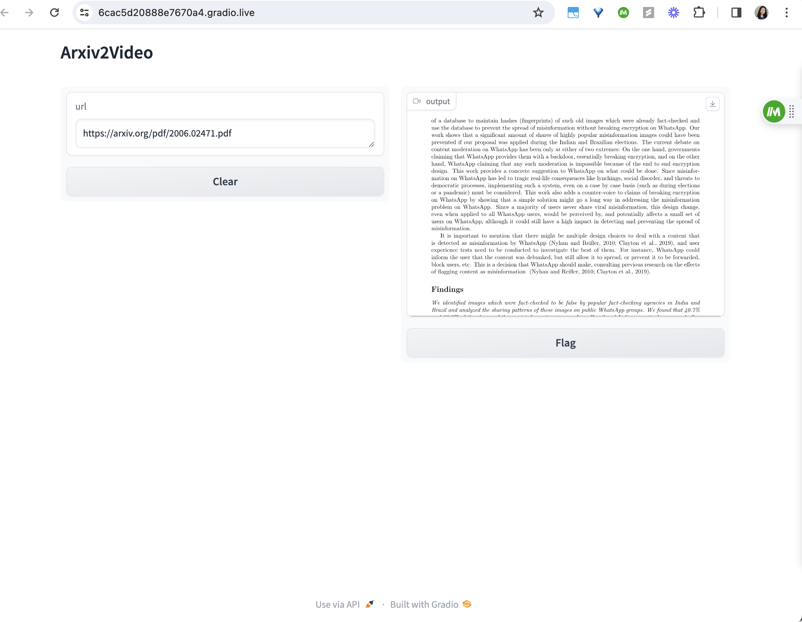

# Arxiv2Video

Arxiv2Video is an automated Two-minute papers converter using LLM's.

It is a Gradio application that converts a paper on Arxiv via the paper's url into a short-form video. 

### Technologies used:
- Milvus for the vector database running locally via a Dockerfile
- ElevenLabs for text to speech
- Langchain PromptTemplate, StuffDocumentsChain, PyPDFLoader and LLMChain
- OpenAI
- Feedparser, Requests, Pdf2Image, Pillow, Pydub, Moviepy
- Gradio to display an interface

[See Here for the Full 3:28 min Video Generated from URL](2006.02471.mp4)

